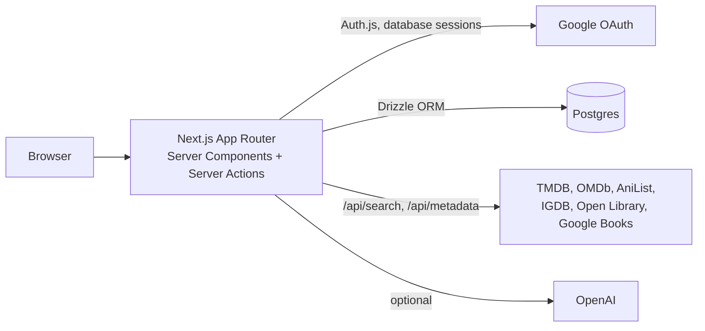

# Cosmic Watchlist

A server-first watchlist for anime, film, TV, games and books, with Google sign-in, metadata enrichment from public catalogs, shareable filters and stats.

[](#status)


[](https://stargazers-cosmic-watchlist.vercel.app)

<p align="center">
  
  
</p>

## What it does

- Create, edit, delete and bulk-update items through Server Actions, validated with Zod and scoped to the signed-in user.
- Filter by type, status and search text; filters live in URL params, so any view can be shared or bookmarked.
- Enrich items with posters, synopsis, cast, genres and runtime from TMDB, OMDb, AniList, IGDB, Open Library and Google Books, depending on type and which keys are configured.
- Stats: completion rate, runtime by type, activity heatmap, top genres, studios and tags.
- Recommendations seeded from completed or highly rated items (TMDB similar titles).
- Import a Letterboxd CSV export.
- Optional AI tagging of items with OpenAI.
- Public read-only share page at `/share/<handle>`, opt-in and revocable, with handle regeneration.
- A `/demo` route with seeded data that works without signing in.
- In-app feedback and bug reports, triaged from an admin page gated by `ADMIN_EMAILS`.

## How it works



Pages render on the server and mutations are Server Actions that call `revalidatePath` afterwards, so there is no client-side state store. Notable details:

- **Auth.** Auth.js (NextAuth v5) with the Drizzle adapter and `database` session strategy; admin rights are granted at sign-in from an email allowlist.
- **Ownership checks.** Every update and delete query filters on both item id and `userId`.
- **Write quotas.** Before inserts, `lib/limits.ts` checks per-user total and daily counts and global total and daily counts (defaults 2,000 / 250 / 200,000 / 5,000, overridable by env), which bounds abuse and database growth on a free tier.
- **Schema.** `db/schema.ts` defines Postgres enums for item type and status plus `users`, `accounts`, `sessions`, `verification_tokens`, `items` and `events`. SQL migrations are in `drizzle/`.
- **Tests.** Vitest covers validation, metadata fetching, recommendations, Letterboxd parsing, analytics and admin feedback.

## Getting started

Requires Node.js and a Postgres database.

```bash
git clone https://github.com/NaxeCode/Cosmic-Watchlist.git
cd Cosmic-Watchlist
npm install
cp .env.example .env.local
npm run db:push
npm run db:seed
npm run dev          # http://localhost:3000
```

Required env: `DATABASE_URL`, `GOOGLE_CLIENT_ID`, `GOOGLE_CLIENT_SECRET`, `NEXTAUTH_SECRET`.
Optional: `TMDB_API_KEY`, `OMDB_API_KEY`, `IGDB_CLIENT_ID`, `IGDB_CLIENT_SECRET`, `OPENAI_API_KEY`, `ADMIN_EMAILS`, `NEXT_PUBLIC_GA_MEASUREMENT_ID`.

Other scripts: `npm test`, `npm run lint`, `npm run build`, `npm run db:studio`.

## Status

Deployed on Vercel. The live demo at `/demo` shows the dashboard with seeded data. Hosting is serverless, which keeps cost near zero; the trade-off is cold starts on rarely hit routes and no place for long-running background work.

## How this project is run

[](https://linear.app)
[](AGENTS.md)
[](#how-this-project-is-run)

- **Planning:** work is tracked in Linear as initiatives → projects → milestones → issues; branches and PR titles carry the issue ID so status moves automatically from In Progress to Done.
- **Review:** every pull request gets an automatic Codex review guided by this repo's own Code Review Rules in [`AGENTS.md`](AGENTS.md), and review threads must be resolved before merge.
- **Guardrails:** the default branch (`main`) only changes through pull requests — no direct pushes or force-pushes.

## License

MIT. See [LICENSE](LICENSE).

---
<sub>Built by [Aladdin Ali](https://github.com/NaxeCode) · [naxecode.github.io](https://naxecode.github.io)</sub>
